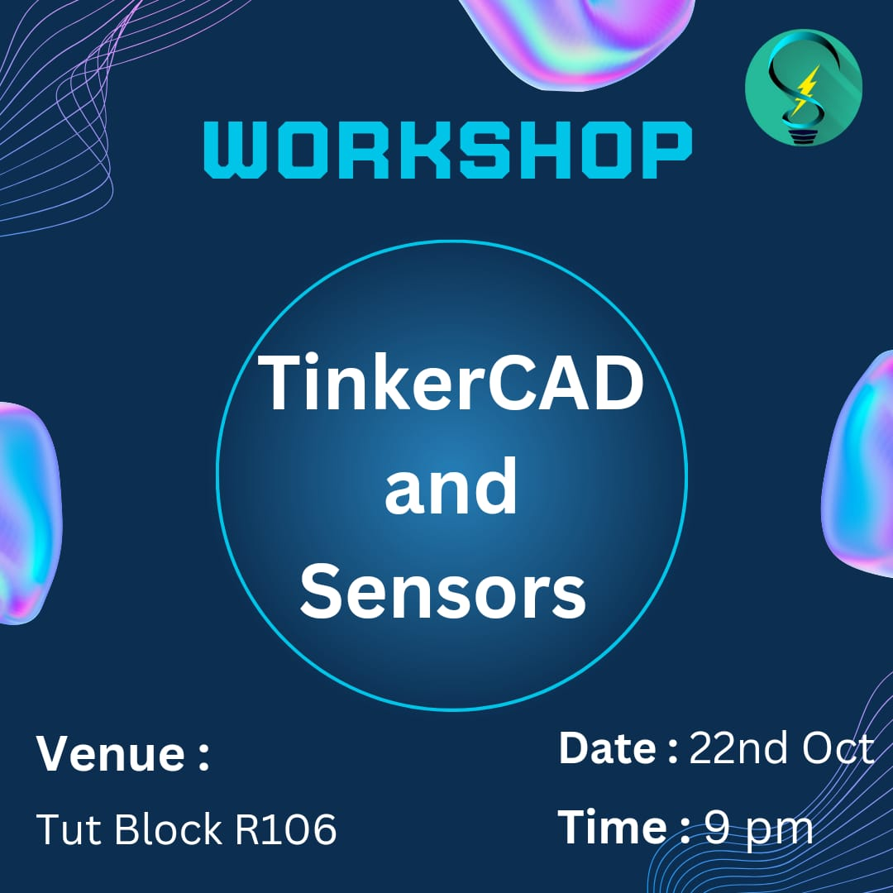
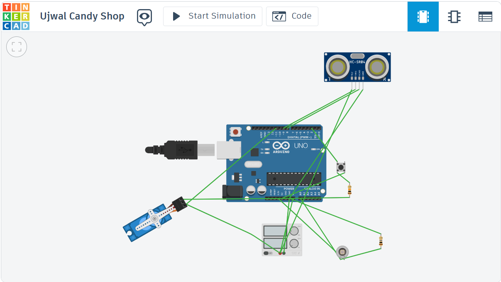
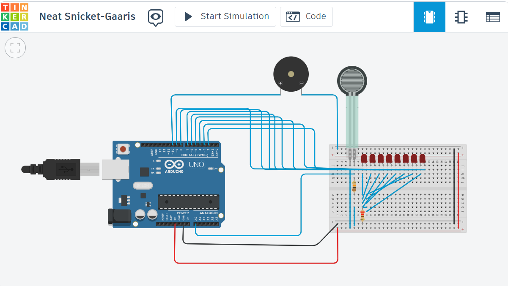
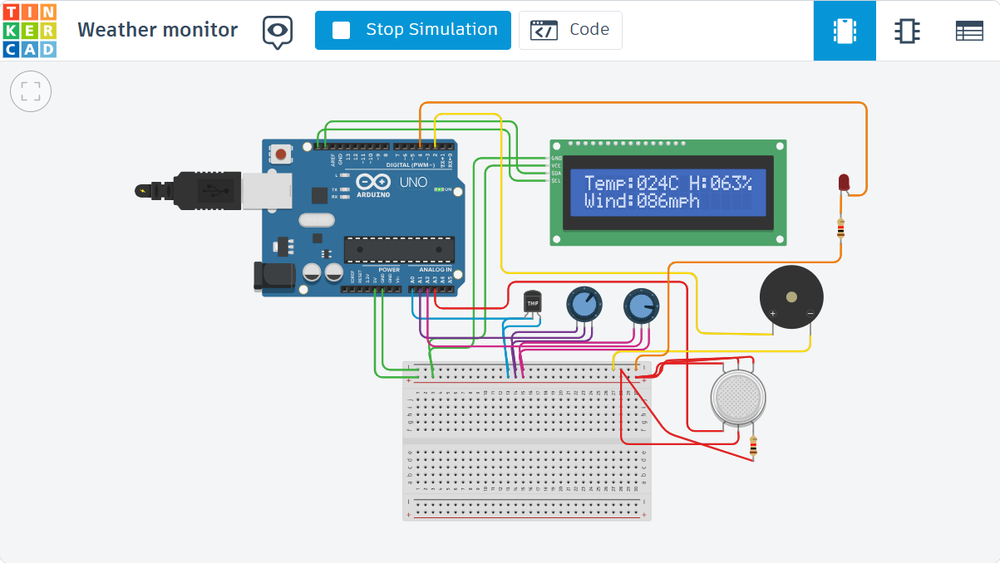
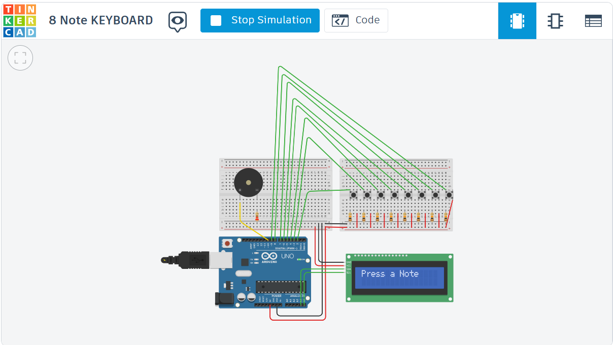
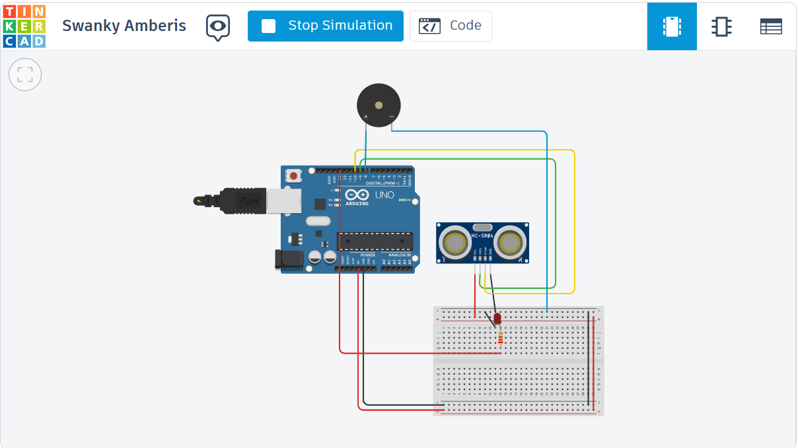
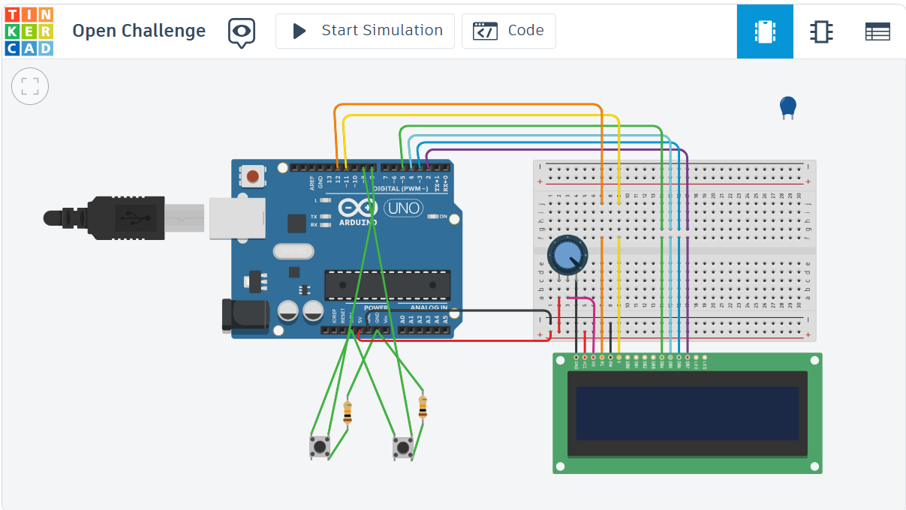
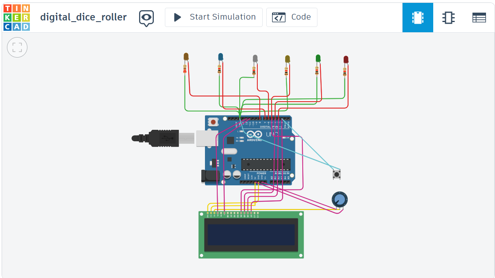

# Tinkercad & Sensors Session - Sparkonics, IIT Patna

 <!-- Replace with the actual path if different -->

## Session Link
[Click here to view the Tinkercad session materials](TinkerCAD&Sensors.pptx)

---

## Student Submissions

### Ujwal's Candy Shop 
- Ujwal owns a candy shop and wants to create an Automatic Door System that opens when
customers approach during the day but remains closed at night, as the shop closes as soon as
the sun sets. Design a system that automatically operates the door based on the time of day,
ensuring it only functions while it's light outside.
Bonus: Include a manual override feature that allows the door to be opened or closed
regardless of the time of day.
  - **Anany Raghav, 2401EC06**
  - 
  - [Tinkercad Link](https://www.tinkercad.com/things/iYO3dTtDCBf-ujwal-candy-shop?sharecode=6AeTYkzfgscu6UrNtH6ZKLv5kKY41-dgoUNu85N3f0o)

### Strongman Game
  - At a fair, just before your turn in the High-Striker (Strongman Game), the game malfunctions.
Your task is to design a system that simulates the game.
The system should:
1. Measure and respond to the force applied.
2. Display the strength level progressively (not necessarily just on an LCD screen).
3. Trigger an alert when the maximum force is reached.
Bonus: Add a visually appealing effect when the maximum force is applied.
Note: You are not allowed to use 2-pin or 4-pin LEDs.

   - **Devesh Yadav, 2401EC08**
   - 
   - [Tinkercad Link](https://www.tinkercad.com/things/4Zyj8a14uh5-neat-snicket-gaaris)

### Weather Monitoring System with Fire Alarm
  - Design a Weather Monitoring System that can:
    1. Measure and display temperature, wind speed, and humidity on an LCD screen.
    2. Activate an alarm system when a fire is detected.
    Make sure the system:
    ● Continuously displays the weather readings on the LCD screen.
    ● Sounds an alarm when a fire is detected.
    Bonus: Add an extra feature where the system changes the color of an LED or display when
    the temperature crosses a certain threshold (e.g., indicating a heat wave).

     - **Parth Saini, 2401EE07**
     -
     - [Tinkercad Link](https://www.tinkercad.com/things/09vKL9oIg2f-weather-monitor)

### Open challenge

- **8 Note Keyboard**
  - by **Priyadeep Jaiswal, 2401EC10**
    -
    - [Tinkercad Link](https://www.tinkercad.com/things/64zIrWg4Q4f-8-note-keyboard?sharecode=8OVm2iOPBaqhO0KdhUasVazJxn3lQx6H-ZOv9ADLAx0)

- **OverSpeed Detector**
  - by **Shashank Mishra, 2401EC36**
    -
    - [Tinkercad Link](https://www.tinkercad.com/things/0XcVUE9XJiz-swanky-amberis)

- **Math Quiz**
  - by **Anany Raghav, 2401EC06**
    -
    - [Tinkercad Link](https://www.tinkercad.com/things/iYimA7oILzQ-open-challenge?sharecode=bH2_27DXnUYGulmZuZUmD2sIATqmWiA6gyAEOUKGqFc)

- **Digital Dice**
- by **PIYUSH PUSKAR, 2401EC28**
- 
- [Tinkercad Link](https://www.tinkercad.com/things/3GjbrLMmoEI-digitaldiceroller?sharecode=YqDFV0juDyn4Qe1uvHQycj6q9HS-K5qXpN-56U28B8M)
